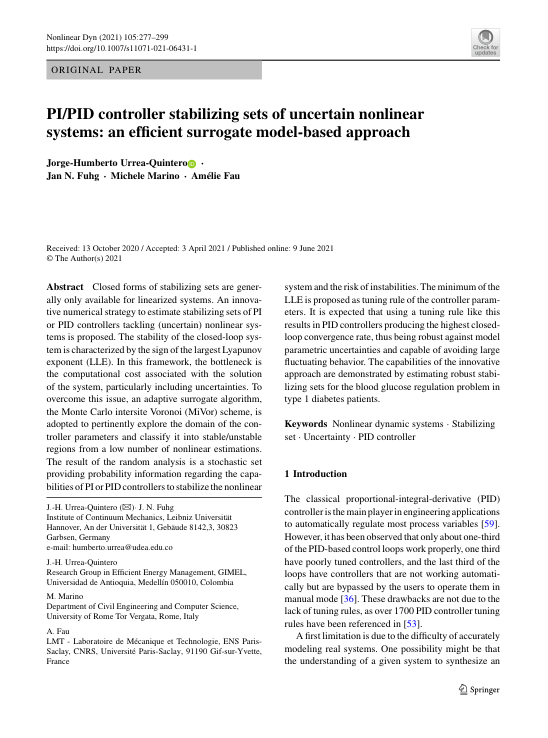

 

 
 
## Abstract 
Closed forms of stabilizing sets are generally only available for linearized systems. An innovative numerical strategy to estimate stabilizing sets of PI or PID controllers tackling (uncertain) nonlinear systems is proposed. The stability of the closed-loop system is characterized by the sign of the largest Lyapunov exponent (LLE). In this framework, the bottleneck is the computational cost associated with the solution of the system, particularly including uncertainties. To overcome this issue, an adaptive surrogate algorithm, the Monte Carlo intersite Voronoi (MiVor) scheme, is adopted to pertinently explore the domain of the controller parameters and classify it into stable/unstable regions from a low number of nonlinear estimations. The result of the random analysis is a stochastic set providing probability information regarding the capabilities of PI or PID controllers to stabilize the nonlinear system and the risk of instabilities. The minimum of the LLE is proposed as tuning rule of the controller parameters. It is expected that using a tuning rule like this results in PID controllers producing the highest closed-loop convergence rate, thus being robust against model parametric uncertainties and capable of avoiding large fluctuating behavior. The capabilities of the innovative approach are demonstrated by estimating robust stabilizing sets for the blood glucose regulation problem in type 1 diabetes patients. © 2021, The Author(s).
 
[Download paper here](https://www.scopus.com/inward/record.uri?eid=2-s2.0-85107494472&doi=10.1007%2fs11071-021-06431-1&partnerID=40&md5=351cd8fd311f4ba0c3dd414c347004a4)