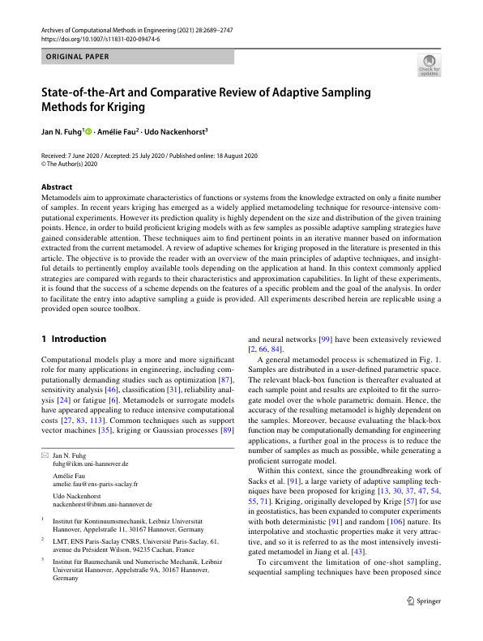

 

 
 
## Abstract 
Metamodels aim to approximate characteristics of functions or systems from the knowledge extracted on only a finite number of samples. In recent years kriging has emerged as a widely applied metamodeling technique for resource-intensive computational experiments. However its prediction quality is highly dependent on the size and distribution of the given training points. Hence, in order to build proficient kriging models with as few samples as possible adaptive sampling strategies have gained considerable attention. These techniques aim to find pertinent points in an iterative manner based on information extracted from the current metamodel. A review of adaptive schemes for kriging proposed in the literature is presented in this article. The objective is to provide the reader with an overview of the main principles of adaptive techniques, and insightful details to pertinently employ available tools depending on the application at hand. In this context commonly applied strategies are compared with regards to their characteristics and approximation capabilities. In light of these experiments, it is found that the success of a scheme depends on the features of a specific problem and the goal of the analysis. In order to facilitate the entry into adaptive sampling a guide is provided. All experiments described herein are replicable using a provided open source toolbox. © 2020, The Author(s).
 
[Download paper here](https://www.scopus.com/inward/record.uri?eid=2-s2.0-85089828606&doi=10.1007%2fs11831-020-09474-6&partnerID=40&md5=77bf1f50a6753413c393d5b357d560ba)