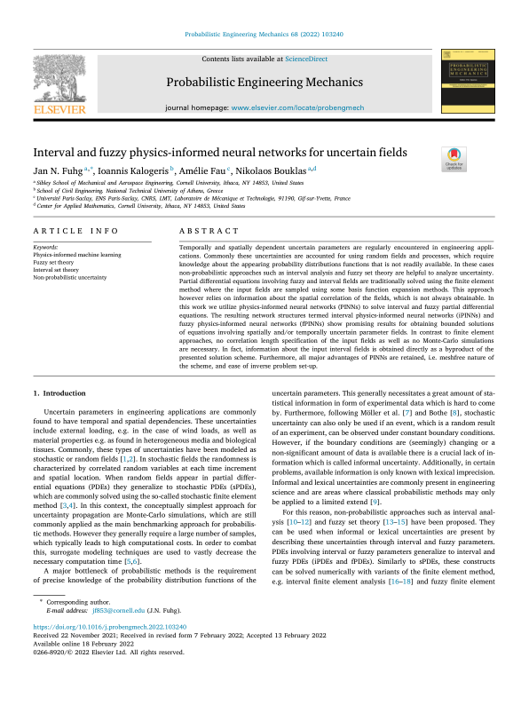

 

 
 
## Abstract 
Temporally and spatially dependent uncertain parameters are regularly encountered in engineering applications. Commonly these uncertainties are accounted for using random fields and processes, which require knowledge about the appearing probability distributions functions that is not readily available. In these cases non-probabilistic approaches such as interval analysis and fuzzy set theory are helpful to analyze uncertainty. Partial differential equations involving fuzzy and interval fields are traditionally solved using the finite element method where the input fields are sampled using some basis function expansion methods. This approach however relies on information about the spatial correlation of the fields, which is not always obtainable. In this work we utilize physics-informed neural networks (PINNs) to solve interval and fuzzy partial differential equations. The resulting network structures termed interval physics-informed neural networks (iPINNs) and fuzzy physics-informed neural networks (fPINNs) show promising results for obtaining bounded solutions of equations involving spatially and/or temporally uncertain parameter fields. In contrast to finite element approaches, no correlation length specification of the input fields as well as no Monte-Carlo simulations are necessary. In fact, information about the input interval fields is obtained directly as a byproduct of the presented solution scheme. Furthermore, all major advantages of PINNs are retained, i.e. meshfree nature of the scheme, and ease of inverse problem set-up. © 2022 Elsevier Ltd
 
[Download paper here](https://www.scopus.com/inward/record.uri?eid=2-s2.0-85125615969&doi=10.1016%2fj.probengmech.2022.103240&partnerID=40&md5=ce0851a3cfb22268e11e706a61e3e725)