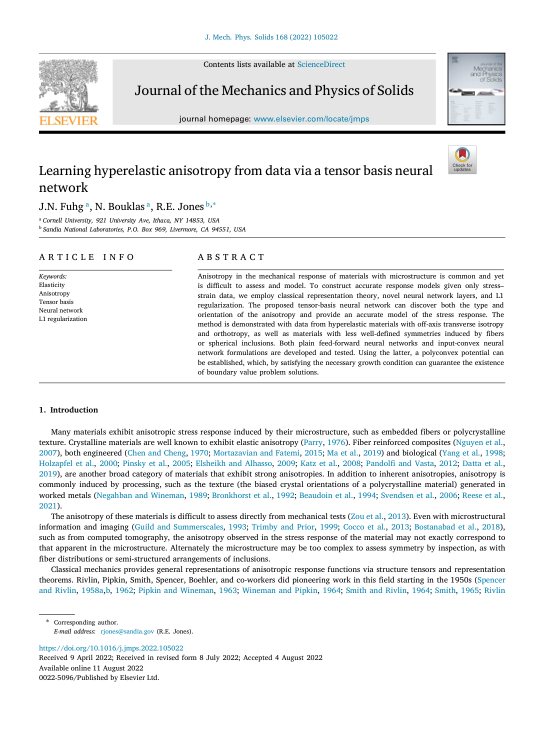

 

 
 
## Abstract 
Anisotropy in the mechanical response of materials with microstructure is common and yet is difficult to assess and model. To construct accurate response models given only stress–strain data, we employ classical representation theory, novel neural network layers, and L1 regularization. The proposed tensor-basis neural network can discover both the type and orientation of the anisotropy and provide an accurate model of the stress response. The method is demonstrated with data from hyperelastic materials with off-axis transverse isotropy and orthotropy, as well as materials with less well-defined symmetries induced by fibers or spherical inclusions. Both plain feed-forward neural networks and input-convex neural network formulations are developed and tested. Using the latter, a polyconvex potential can be established, which, by satisfying the necessary growth condition can guarantee the existence of boundary value problem solutions. © 2022
 
[Download paper here](https://www.scopus.com/inward/record.uri?eid=2-s2.0-85136516056&doi=10.1016%2fj.jmps.2022.105022&partnerID=40&md5=1d8fc34fe11fb049004c6d344619ff43)