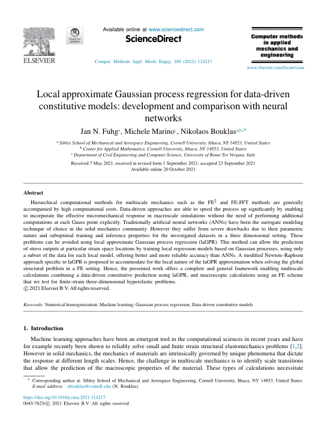

 

 
 
## Abstract 
Hierarchical computational methods for multiscale mechanics such as the FE2 and FE-FFT methods are generally accompanied by high computational costs. Data-driven approaches are able to speed the process up significantly by enabling to incorporate the effective micromechanical response in macroscale simulations without the need of performing additional computations at each Gauss point explicitly. Traditionally artificial neural networks (ANNs) have been the surrogate modeling technique of choice in the solid mechanics community. However they suffer from severe drawbacks due to their parametric nature and suboptimal training and inference properties for the investigated datasets in a three dimensional setting. These problems can be avoided using local approximate Gaussian process regression (laGPR). This method can allow the prediction of stress outputs at particular strain space locations by training local regression models based on Gaussian processes, using only a subset of the data for each local model, offering better and more reliable accuracy than ANNs. A modified Newton–Raphson approach specific to laGPR is proposed to accommodate for the local nature of the laGPR approximation when solving the global structural problem in a FE setting. Hence, the presented work offers a complete and general framework enabling multiscale calculations combining a data-driven constitutive prediction using laGPR, and macroscopic calculations using an FE scheme that we test for finite-strain three-dimensional hyperelastic problems. © 2021 Elsevier B.V.
 
[Download paper here](https://www.scopus.com/inward/record.uri?eid=2-s2.0-85117270089&doi=10.1016%2fj.cma.2021.114217&partnerID=40&md5=e85d8fed28e9c0b4afc2be963805f42d)