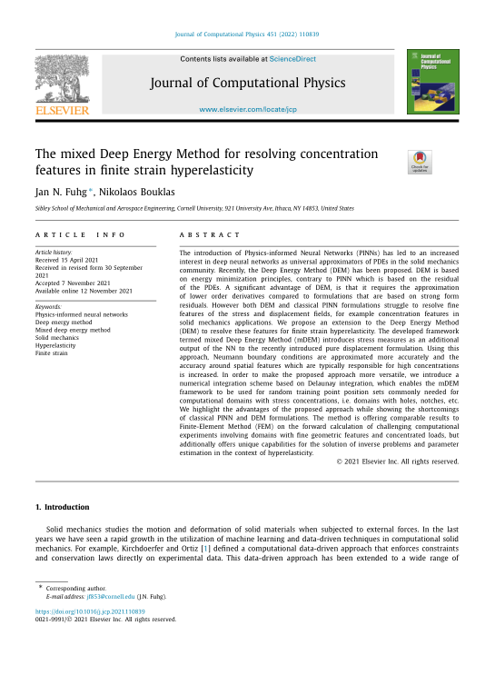

 

 
 
## Abstract 
The introduction of Physics-informed Neural Networks (PINNs) has led to an increased interest in deep neural networks as universal approximators of PDEs in the solid mechanics community. Recently, the Deep Energy Method (DEM) has been proposed. DEM is based on energy minimization principles, contrary to PINN which is based on the residual of the PDEs. A significant advantage of DEM, is that it requires the approximation of lower order derivatives compared to formulations that are based on strong form residuals. However both DEM and classical PINN formulations struggle to resolve fine features of the stress and displacement fields, for example concentration features in solid mechanics applications. We propose an extension to the Deep Energy Method (DEM) to resolve these features for finite strain hyperelasticity. The developed framework termed mixed Deep Energy Method (mDEM) introduces stress measures as an additional output of the NN to the recently introduced pure displacement formulation. Using this approach, Neumann boundary conditions are approximated more accurately and the accuracy around spatial features which are typically responsible for high concentrations is increased. In order to make the proposed approach more versatile, we introduce a numerical integration scheme based on Delaunay integration, which enables the mDEM framework to be used for random training point position sets commonly needed for computational domains with stress concentrations, i.e. domains with holes, notches, etc. We highlight the advantages of the proposed approach while showing the shortcomings of classical PINN and DEM formulations. The method is offering comparable results to Finite-Element Method (FEM) on the forward calculation of challenging computational experiments involving domains with fine geometric features and concentrated loads, but additionally offers unique capabilities for the solution of inverse problems and parameter estimation in the context of hyperelasticity. © 2021 Elsevier Inc.
 
[Download paper here](https://www.scopus.com/inward/record.uri?eid=2-s2.0-85119486858&doi=10.1016%2fj.jcp.2021.110839&partnerID=40&md5=cdc088cb64ce94b57ffc2f3a3483cda2)