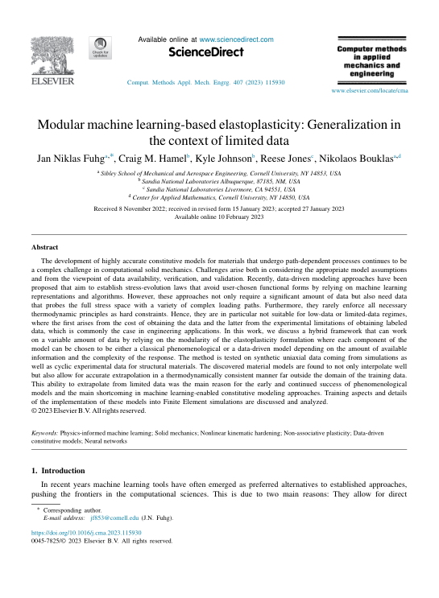

 

 
 
## Abstract 
The development of highly accurate constitutive models for materials that undergo path-dependent processes continues to be a complex challenge in computational solid mechanics. Challenges arise both in considering the appropriate model assumptions and from the viewpoint of data availability, verification, and validation. Recently, data-driven modeling approaches have been proposed that aim to establish stress-evolution laws that avoid user-chosen functional forms by relying on machine learning representations and algorithms. However, these approaches not only require a significant amount of data but also need data that probes the full stress space with a variety of complex loading paths. Furthermore, they rarely enforce all necessary thermodynamic principles as hard constraints. Hence, they are in particular not suitable for low-data or limited-data regimes, where the first arises from the cost of obtaining the data and the latter from the experimental limitations of obtaining labeled data, which is commonly the case in engineering applications. In this work, we discuss a hybrid framework that can work on a variable amount of data by relying on the modularity of the elastoplasticity formulation where each component of the model can be chosen to be either a classical phenomenological or a data-driven model depending on the amount of available information and the complexity of the response. The method is tested on synthetic uniaxial data coming from simulations as well as cyclic experimental data for structural materials. The discovered material models are found to not only interpolate well but also allow for accurate extrapolation in a thermodynamically consistent manner far outside the domain of the training data. This ability to extrapolate from limited data was the main reason for the early and continued success of phenomenological models and the main shortcoming in machine learning-enabled constitutive modeling approaches. Training aspects and details of the implementation of these models into Finite Element simulations are discussed and analyzed. © 2023 Elsevier B.V.
 
[Download paper here](https://www.scopus.com/inward/record.uri?eid=2-s2.0-85147853229&doi=10.1016%2fj.cma.2023.115930&partnerID=40&md5=67d4a639a4ec159c002deae4ce42cc25)